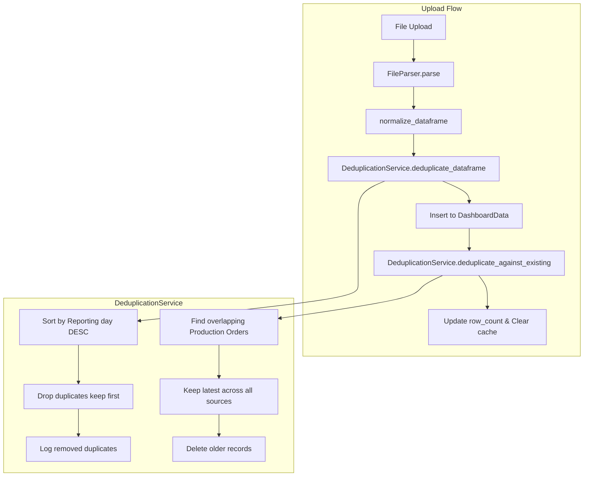

# Design Document: Production Order Deduplication

## Overview

Thiết kế hệ thống deduplication để loại bỏ các Production Order trùng lặp trong dashboard data. Hệ thống sẽ tự động xử lý khi upload file - giữ lại bản ghi có Reporting day mới nhất khi cùng một Production Order xuất hiện ở nhiều ngày khác nhau.

### Nguyên tắc hoạt động

```
Input Data (từ file upload):
| Production Order No. | Reporting Day | Status |
|----------------------|---------------|--------|
| RR11541B             | 2024-11-25    | HOLD   |
| RR11541E             | 2024-11-25    | LOCK   |
| RR11541B             | 2024-11-30    | HOLD   |  ← Giữ lại (mới nhất)
| RR11541E             | 2024-11-30    | LOCK   |  ← Giữ lại (mới nhất)

Output Data (sau deduplication):
| Production Order No. | Reporting Day | Status |
|----------------------|---------------|--------|
| RR11541B             | 2024-11-30    | HOLD   |
| RR11541E             | 2024-11-30    | LOCK   |
```

## Architecture



## Components and Interfaces

### 1. DeduplicationService

Tạo file mới: `packages/backend/app/services/deduplication.py`

```python
from dataclasses import dataclass
from datetime import datetime
from typing import Optional
import pandas as pd
from sqlalchemy.ext.asyncio import AsyncSession
import logging

logger = logging.getLogger(__name__)

@dataclass
class DeduplicationResult:
    """Result of deduplication operation"""
    original_count: int
    duplicates_removed: int
    final_count: int
    duplicate_details: list[dict]  # [{production_order: str, dates_removed: list[str]}]

class DeduplicationService:
    """Service to handle Production Order deduplication during upload"""
    
    @staticmethod
    def deduplicate_dataframe(df: pd.DataFrame) -> tuple[pd.DataFrame, DeduplicationResult]:
        """
        Deduplicate DataFrame by keeping only the latest Reporting day 
        for each Production Order No.
        
        Args:
            df: DataFrame with 'Production Order No.' and 'Reporting day' columns
            
        Returns:
            Tuple of (deduplicated DataFrame, DeduplicationResult)
        """
        pass
    
    @staticmethod
    async def deduplicate_against_existing(
        db: AsyncSession, 
        new_source_id: int
    ) -> DeduplicationResult:
        """
        After inserting new data, deduplicate against existing records 
        from other sources. Keeps the record with latest Reporting day.
        
        Args:
            db: Database session
            new_source_id: ID of the newly uploaded source
            
        Returns:
            DeduplicationResult with statistics
        """
        pass
```

### 2. Updated Data Model

Cập nhật `packages/backend/app/models/models.py`:

```python
class DashboardData(Base):
    __tablename__ = "dashboard_data"
    id = Column(Integer, primary_key=True)
    source_id = Column(Integer, ForeignKey("data_sources.id"), index=True)
    reporting_day = Column(Date, index=True)
    production_order_no = Column(String(100), index=True)  # NEW: Mã đơn hàng
    customer = Column(String(255), index=True)
    category = Column(String(255), index=True)
    product = Column(String(255), index=True)
    status = Column(String(50), index=True)
    current_status = Column(String(50))
    production_no = Column(Integer)  # Số lượng sản xuất
    root_cause = Column(String(500))
    improvement_plan = Column(Text)
    created_at = Column(DateTime, server_default=func.now())
```

### 3. Updated Column Mapping

Cập nhật trong `packages/backend/app/api/datasources.py`:

```python
column_mapping = {
    'Reporting day': 'reporting_day',
    'Production Order No.': 'production_order_no',  # NEW
    'Customer': 'customer',
    'Category': 'category',
    'Product': 'product',
    'Status': 'status',
    'Current status': 'current_status',
    'Currrent status': 'current_status',  # Handle typo
    'Production No': 'production_no',
    'Root cause': 'root_cause',
    'Improvement plan': 'improvement_plan'
}
```

### 4. Updated Upload Flow

Cập nhật `process_upload_task` trong `datasources.py`:

```python
async def process_upload_task(source_id: int, file_path: str, data_type: str):
    async with async_session() as db:
        try:
            # ... existing code ...
            
            if data_type == "dashboard":
                # Step 1: Parse and normalize
                df_new = normalize_dataframe(df_new)
                
                # Step 2: Deduplicate within the uploaded file
                df_new, file_dedup_result = DeduplicationService.deduplicate_dataframe(df_new)
                logger.info(f"File deduplication: removed {file_dedup_result.duplicates_removed} duplicates")
                
                # Step 3: Insert deduplicated data to database
                # ... existing insert code with updated column_mapping ...
                
                # Step 4: Deduplicate against existing data from other sources
                db_dedup_result = await DeduplicationService.deduplicate_against_existing(db, source_id)
                logger.info(f"DB deduplication: removed {db_dedup_result.duplicates_removed} duplicates")
                
                # Step 5: Update row_count to reflect actual records
                actual_count = await get_actual_row_count(db, source_id)
                source.row_count = actual_count
                
            # ... rest of existing code ...
```

## Algorithm

### DataFrame Deduplication (trong file upload)

```python
@staticmethod
def deduplicate_dataframe(df: pd.DataFrame) -> tuple[pd.DataFrame, DeduplicationResult]:
    """
    Algorithm:
    1. Check required columns exist
    2. Sort by Production Order No. and Reporting day (descending)
    3. Drop duplicates keeping first (which is the latest date)
    4. Track what was removed for logging
    """
    original_count = len(df)
    
    # Check required columns
    if 'Production Order No.' not in df.columns or 'Reporting day' not in df.columns:
        logger.warning("Missing required columns for deduplication, skipping")
        return df, DeduplicationResult(
            original_count=original_count,
            duplicates_removed=0,
            final_count=original_count,
            duplicate_details=[]
        )
    
    # Sort by date descending so latest comes first
    df_sorted = df.sort_values('Reporting day', ascending=False)
    
    # Find duplicates before removing
    duplicates = df_sorted[df_sorted.duplicated('Production Order No.', keep='first')]
    
    # Build duplicate details for logging
    duplicate_details = []
    for order_no in duplicates['Production Order No.'].unique():
        removed_dates = duplicates[
            duplicates['Production Order No.'] == order_no
        ]['Reporting day'].tolist()
        duplicate_details.append({
            'production_order': str(order_no),
            'dates_removed': [str(d) for d in removed_dates]
        })
        logger.info(f"Duplicate found: {order_no} - removing dates: {removed_dates}")
    
    # Remove duplicates, keep first (latest date)
    df_deduped = df_sorted.drop_duplicates('Production Order No.', keep='first')
    
    # Restore original order (optional)
    df_deduped = df_deduped.sort_values('Reporting day', ascending=True)
    
    return df_deduped, DeduplicationResult(
        original_count=original_count,
        duplicates_removed=original_count - len(df_deduped),
        final_count=len(df_deduped),
        duplicate_details=duplicate_details
    )
```

### Database Deduplication (against existing data)

```python
@staticmethod
async def deduplicate_against_existing(
    db: AsyncSession, 
    new_source_id: int
) -> DeduplicationResult:
    """
    After inserting new records, find and remove older duplicates 
    across ALL sources (including the new one).
    
    SQL Logic:
    1. Find all production_order_no that have multiple records
    2. For each, keep only the one with MAX(reporting_day)
    3. Delete the rest
    """
    from sqlalchemy import text
    
    # Count before
    count_before = await db.scalar(
        select(func.count()).select_from(DashboardData)
    )
    
    # Find and delete duplicates in one query
    # Keep the record with latest reporting_day for each production_order_no
    delete_sql = text("""
        DELETE FROM dashboard_data d
        WHERE d.id NOT IN (
            SELECT DISTINCT ON (production_order_no) id
            FROM dashboard_data
            WHERE production_order_no IS NOT NULL
            ORDER BY production_order_no, reporting_day DESC, id DESC
        )
        AND d.production_order_no IS NOT NULL
    """)
    
    result = await db.execute(delete_sql)
    duplicates_removed = result.rowcount
    
    await db.commit()
    
    # Count after
    count_after = await db.scalar(
        select(func.count()).select_from(DashboardData)
    )
    
    return DeduplicationResult(
        original_count=count_before,
        duplicates_removed=duplicates_removed,
        final_count=count_after,
        duplicate_details=[]  # Details not tracked for DB dedup
    )
```

## Database Migration

Cần tạo migration để thêm cột `production_order_no`:

```python
# migrations/versions/xxx_add_production_order_no.py
def upgrade():
    op.add_column('dashboard_data', 
        sa.Column('production_order_no', sa.String(100), nullable=True)
    )
    op.create_index('ix_dashboard_data_production_order_no', 
        'dashboard_data', ['production_order_no'])

def downgrade():
    op.drop_index('ix_dashboard_data_production_order_no')
    op.drop_column('dashboard_data', 'production_order_no')
```

## Correctness Properties

*A property is a characteristic or behavior that should hold true across all valid executions of a system—essentially, a formal statement about what the system should do.*

### Property 1: Latest Date Retention

*For any* set of records with the same Production_Order_No, after deduplication, only the record with the maximum Reporting_Day SHALL remain.

**Validates: Requirements 1.3, 2.1**

### Property 2: Exact String Matching

*For any* two Production_Order_No values that differ by case, whitespace, or any character, they SHALL be treated as distinct orders and both retained.

**Validates: Requirements 1.2**

### Property 3: Unique Record Preservation

*For any* record with a Production_Order_No that appears exactly once in the input, that record SHALL exist unchanged in the output.

**Validates: Requirements 2.4**

### Property 4: Statistics Correctness

*For any* deduplication operation, the returned statistics SHALL satisfy: `original_count - duplicates_removed == final_count`

**Validates: Requirements 2.3, 3.4**

### Property 5: Idempotence

*For any* dataset, applying deduplication twice SHALL produce the same result as applying it once: `deduplicate(deduplicate(data)) == deduplicate(data)`

**Validates: Requirements 2.1, 2.4**

## Error Handling

| Error Scenario | Handling Strategy |
|----------------|-------------------|
| Missing Production Order No. column | Skip deduplication, log warning, continue with original data |
| Missing Reporting day column | Skip deduplication, log warning, continue with original data |
| Invalid date format | Parse error logged, record excluded from deduplication |
| Database error during dedup | Rollback transaction, mark source as error |
| Empty dataset | Return immediately with zero counts |

## Testing Strategy

### Unit Tests

- Test `deduplicate_dataframe` với các DataFrame inputs khác nhau
- Test edge cases: empty DataFrame, single record, all duplicates, no duplicates
- Test với Production Order No. có special characters

### Property-Based Tests

Sử dụng `hypothesis` library cho Python:

```python
from hypothesis import given, strategies as st
import pandas as pd

@given(st.lists(st.tuples(
    st.text(min_size=1, max_size=20),  # Production Order No
    st.dates()  # Reporting day
), min_size=0, max_size=100))
def test_latest_date_retention(records):
    """Property 1: Only latest date retained for each order"""
    df = pd.DataFrame(records, columns=['Production Order No.', 'Reporting day'])
    result, _ = DeduplicationService.deduplicate_dataframe(df)
    
    for order in result['Production Order No.'].unique():
        result_date = result[result['Production Order No.'] == order]['Reporting day'].iloc[0]
        original_dates = df[df['Production Order No.'] == order]['Reporting day']
        assert result_date == original_dates.max()

@given(st.lists(st.tuples(
    st.text(min_size=1, max_size=20),
    st.dates()
), min_size=0, max_size=50))
def test_idempotence(records):
    """Property 5: Deduplication is idempotent"""
    df = pd.DataFrame(records, columns=['Production Order No.', 'Reporting day'])
    result1, _ = DeduplicationService.deduplicate_dataframe(df)
    result2, _ = DeduplicationService.deduplicate_dataframe(result1)
    
    pd.testing.assert_frame_equal(
        result1.reset_index(drop=True), 
        result2.reset_index(drop=True)
    )
```

### Integration Tests

- Test full upload flow với file chứa duplicate data
- Test upload file mới có Production Order trùng với data đã có trong DB
- Test concurrent uploads

